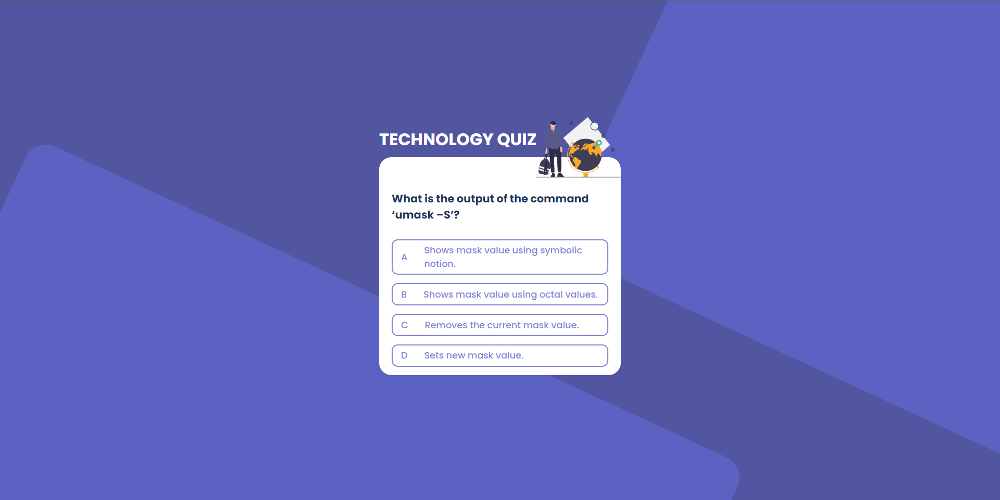
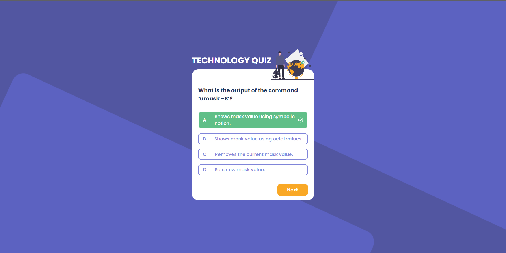
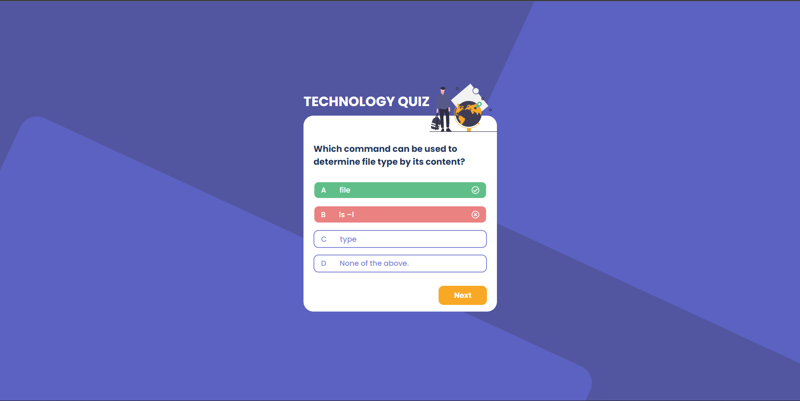

# Challenge Weather App

Este projeto foi desenvolvido em inspiração no desafio Country Quiz do [devChallenges](https://devchallenges.io/challenges/Bu3G2irnaXmfwQ8sZkw8).

## :computer: Tecnologias Utilizadas
#### * [ReactJS](https://reactjs.org/)
#### * [TypeScript](https://www.typescriptlang.org/)

## :closed_book: Bibliotecas Utilizadas
#### * [Styled Component](https://styled-components.com/)
#### * [Axios](https://github.com/axios/axios)
#### * [Prettier](https://prettier.io/)
#### * [ESlint](https://eslint.org/)

## Telas do Projeto

  
   
  
  

## :rocket: Funcionalidade
Aplicação feita com o intuito de informar de trazer uma distração para o usuário testando ao mesmo tempo os seus conhecimentos tecnológicos e mostra o resultado ao final.

### :computer: Como instalar?
* Clone este repositório, entre na pasta do projeto e digite o comando ``yarn install`` ou apenas ``yarn`` no seu terminal. 

* Acesse a documentação do [Quiz Api](https://quizapi.io/docs/1.0/overview) e siga as instruções para criação de chave da API. Em seguida, crie um arquivo .env, crie uma variável com o nome ``REACT_APP_APIKEY`` e adicione a sua chave.

* Ao finalizar, digite ``yarn start`` e acesse [http://localhost:3000](http://localhost:3000) para visualizar a aplicação funcionando no seu navegador.

## Desenvolvimento
Projeto feito com carinho por [Grazielle Conceição](https://www.linkedin.com/in/grazielle-concei%C3%A7%C3%A3o-680b29161/) 🚀
